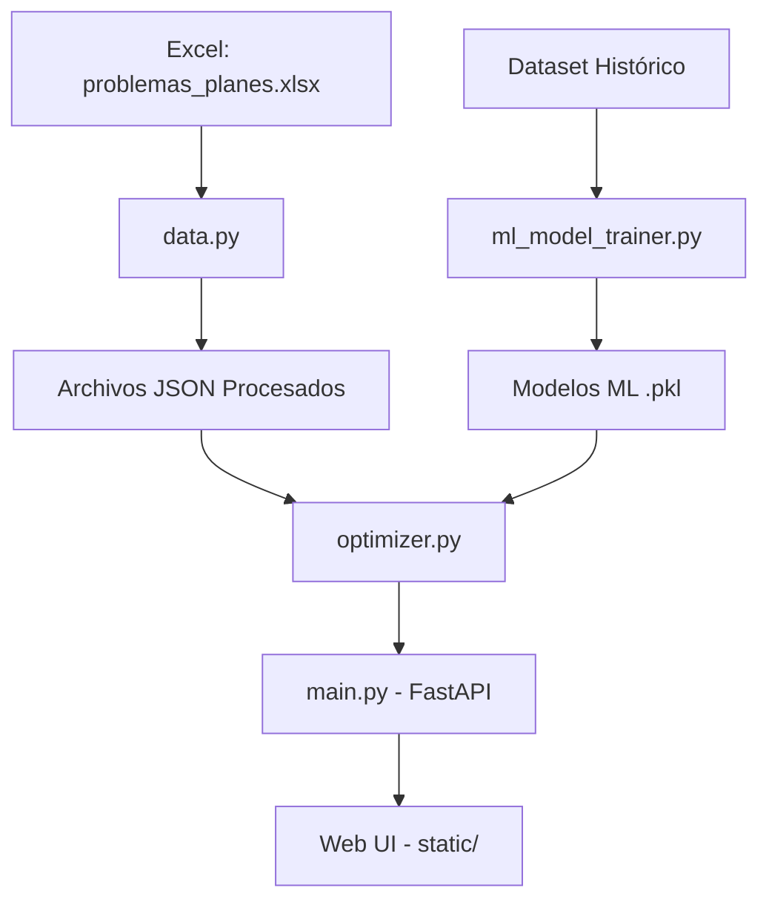

# Documentación del Proyecto: Optimizador Estratégico (TFG)

Este documento proporciona una explicación detallada del código fuente, su arquitectura, implementación y funcionamiento general. El objetivo del proyecto es seleccionar de manera óptima acciones de un catálogo para cubrir necesidades específicas de una empresa, integrando heurísticas de negocio con un modelo de Machine Learning.

## 1. Arquitectura del Sistema

El sistema sigue un flujo de datos que va desde la ingesta de archivos Excel hasta la exposición de una API web para la resolución de optimizaciones en tiempo real.

## 2. Descripción de Módulos

### 2.1. Gestión de Datos (`src/data.py`)

Encargado del proceso ETL (Extract, Transform, Load).

- **Proceso**: Lee `data/problemas_planes.xlsx`, limpia los datos (mapeo de urgencia/importancia/complejidad a escala 1-3) y resuelve valores nulos usando la moda.
- **Resultado**: Genera tres archivos JSON en `data/processed`:
  - `processed_necesidades.json`: Diccionario de necesidades.
  - `processed_planes.json`: Catálogo de planes de acción.
  - `processed_relacion_necesidad_plan.json`: Mapeo de qué planes pueden resolver qué necesidades.

### 2.2. Motor de Optimización (`src/optimizer.py`)

Utiliza Programación Lineal Entera Mixta (MILP) mediante la librería **PuLP**.

- **Variables de Decisión**:
  - `x[i, j]`: Binaria, indica si la necesidad `i` se cubre con el plan `j`.
  - `y[j]`: Binaria, indica si el plan `j` se selecciona.
- **Función Objetivo**: Maximizar un "Score Estratégico":
  $$
  \text{Score} = \sum (\text{BaseWeight}_{ij} + \text{MLBoost}_{ij}) \cdot x_{ij} + 0.01 \cdot \sum y_j
  $$

  Donde el peso base depende de la Urgencia, Importancia, Plazo y Complejidad.
- **Restricciones**:
  - Cubrir todas las necesidades seleccionadas.
  - No exceder el número máximo de acciones (`max_actions`).
  - Coherencia: `x[i, j] \leq y[j]` (solo se asigna si el plan está seleccionado).

### 2.3. Machine Learning y NLP

El proyecto incluye un pipeline de ML para "corregir" las heurísticas basadas en la experiencia histórica.

- **`ml_model_trainer.py`**: Entrena un clasificador **XGBoost**. Utiliza **TF-IDF** para procesar el "Objeto Social" de la empresa y la descripción de la necesidad, permitiendo entender el contexto sectorial.
- **`ml_weight_learner.py`**: Utiliza optimización numérica (`scipy.minimize`) para ajustar los parámetros de la fórmula estratégica ($\alpha, \beta, \gamma, \delta$) basándose en decisiones pasadas de consultores.
- **`ml_explainer.py`**: Usa **SHAP** para proporcionar explicabilidad al modelo, generando gráficos de importancia de características.

### 2.4. Servidor y Frontend (`src/main.py` & `static/`)

- **Backend**: Servidor **FastAPI** que carga los datos en caché al arrancar y expone el endpoint `/solve` para recibir peticiones del frontend.
- **Frontend**: SPA (Single Page Application) construida con HTML/JS vanilla que permite al usuario seleccionar necesidades y ajustar parámetros de optimización.

## 3. Funcionamiento Paso a Paso

1. **Precarga**: La empresa define su catálogo en Excel y se procesa con `data.py`.
2. **Selección**: El usuario accede a la web y selecciona las "Necesidades" críticas.
3. **Optimización Enriquecida**:
   - El motor de búsqueda identifica planes compatibles.
   - El modelo de ML evalúa la afinidad entre el perfil de la empresa y cada relación necesidad-plan.
   - El solver de PuLP encuentra la combinación de acciones que maximiza el valor estratégico total.
4. **Visualización**: Se presentan las acciones recomendadas y su correspondencia con las necesidades.

## 4. Cómo Ejecutar

- **Preparar datos**: `python src/data.py`
- **Entrenar ML (opcional)**: `python src/ml_model_trainer.py`
- **Lanzar Servidor**: `python src/main.py`
- **Acceso**: Abrir `http://localhost:8000` en el navegador.

---

*Este documento ha sido generado automáticamente para facilitar la comprensión y el mantenimiento del TFG.*
