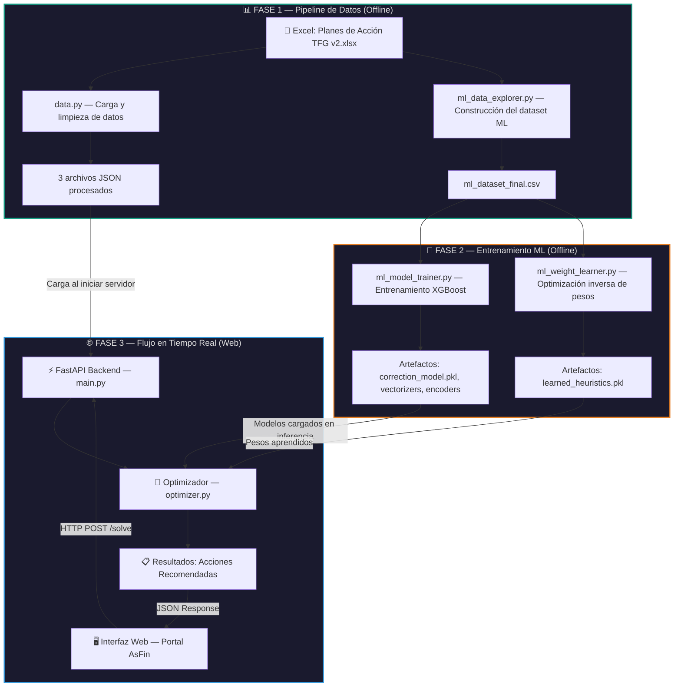
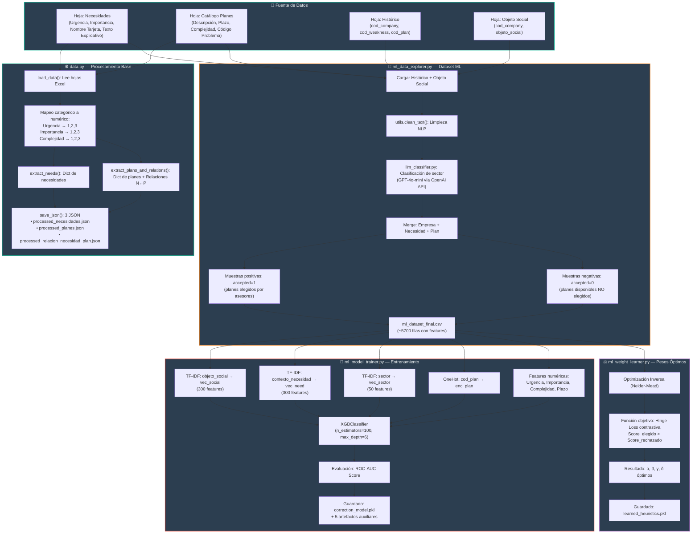
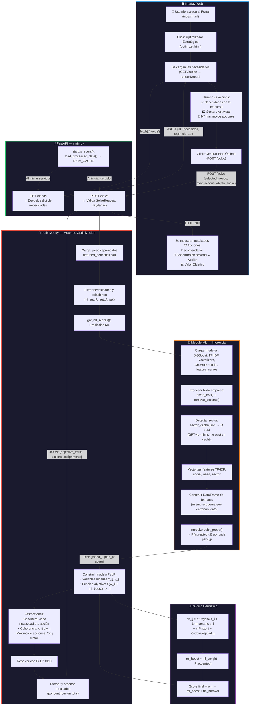

# Diagrama de Flujo del Proyecto — Optimizador Estratégico para PYMEs

## 1. Visión General del Sistema

Este diagrama muestra las **tres grandes fases** del sistema y cómo se conectan entre sí:

---

## 2. Pipeline de Datos y Entrenamiento ML (Detallado)

Este diagrama profundiza en **cómo se procesan los datos** desde el Excel hasta los modelos entrenados:

---

## 3. Flujo en Tiempo Real — Interfaz Web + Backend (Detallado)

Este diagrama muestra **paso a paso** lo que ocurre cuando un usuario interactúa con la web:

---

## 4. Resumen de Archivos por Fase

| Fase | Archivo | Función Principal |
|------|---------|-------------------|
| **Datos** | `data.py` | Carga Excel, limpia y genera 3 JSON procesados |
| **Datos** | `ml_data_explorer.py` | Construye el dataset ML con muestras positivas/negativas |
| **Datos** | `llm_classifier.py` | Clasifica sectores vía GPT-4o-mini (OpenAI API) |
| **Datos** | `utils.py` | Funciones NLP: `clean_text()`, `remove_accents()`, caché de sectores |
| **ML** | `ml_model_trainer.py` | Entrena XGBoost + guarda vectorizers y encoders |
| **ML** | `ml_weight_learner.py` | Optimización inversa para aprender α, β, γ, δ óptimos |
| **ML** | `ml_explainer.py` | Genera explicaciones SHAP de las predicciones |
| **ML** | `compare_ml_vs_heuristic.py` | Compara IA vs heurístico puro por sector |
| **ML** | `ml_verification.py` | Verifica que el ML cambia recomendaciones por sector |
| **Web** | `main.py` | Servidor FastAPI con endpoints `/needs` y `/solve` |
| **Web** | `optimizer.py` | Motor de optimización PuLP + inferencia ML en tiempo real |
| **Web** | `config.py` | Rutas, pesos por defecto y parámetros ML |
| **Frontend** | `index.html` | Portal corporativo AsFin |
| **Frontend** | `optimizer.html` | Interfaz del optimizador estratégico |
| **Frontend** | `optimizer.js` | Lógica JS: carga necesidades, envía solicitudes, muestra resultados |
| **Frontend** | `style.css` + `theme.js` | Diseño visual y toggle modo claro/oscuro |

---

## 5. Flujo Simplificado de un Usuario (End-to-End)

